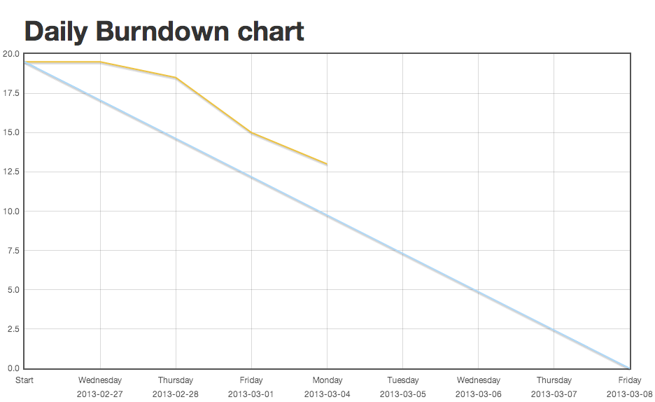
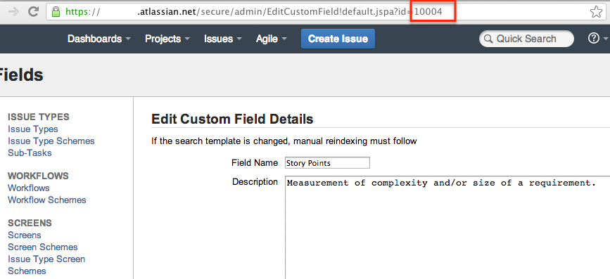

Jira Burndown Wall
================================

A simple JIRA Burndown Wall for anyone using the new boards and Greenhopper 6.1. We got tired of waiting for a Wallboard plugin so we put this one together quickly. It gives you the ability to visualise the team effort on a daily (weekends excluded).
weekend days.

Powered by these awesome javascript frameworks:
 * [JQuery](http://www.jquery.com)
 * [Flotchart](http://www.flotcharts.org/)

Setting it up
-------------------------
 * Start by renaming jira.cfg.example to jira.cfg. Open jira.cfg and configure it with:
 * JIRA_USER, JIRA_PWD credentials that have access to the project you want to show
 * SPRINT_ID - The ID of the sprint [How to find sprint id](https://answers.atlassian.com/questions/81995/get-latest-sprint-id) , [Find Jira sprint ID](https://answers.atlassian.com/questions/66505/jira-how-can-i-find-out-the-sprint-id-of-a-particular-sprint)
 * SPRINT_FIELDNAME and POINTS_FIELDNAME are customfields that can be retrieved by going to the Jira Admin, Custom Fields and choose Edit. The url now reveals the id of the customfield. The id should be on the format "customfield_XXXXX" where XXXXX is the number.
   
 * JIRA_HOST is the hostname/url (without trailing slash) where the JIRA instance is.

Running the download script
-------------------------
Run the ./download.sh and it will retrieve the sprint data from JIRA and put it on disk. Open the public_html/index.html to view the sprint burndown.
Put the script on a cronjob or scheduled task so it will be updated daily.

